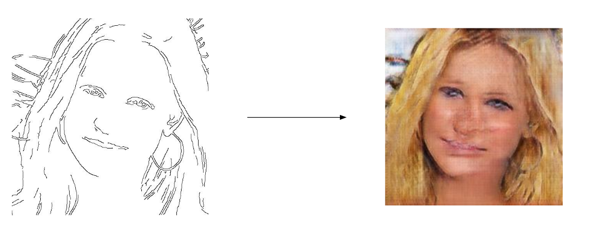
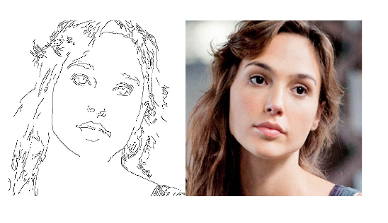
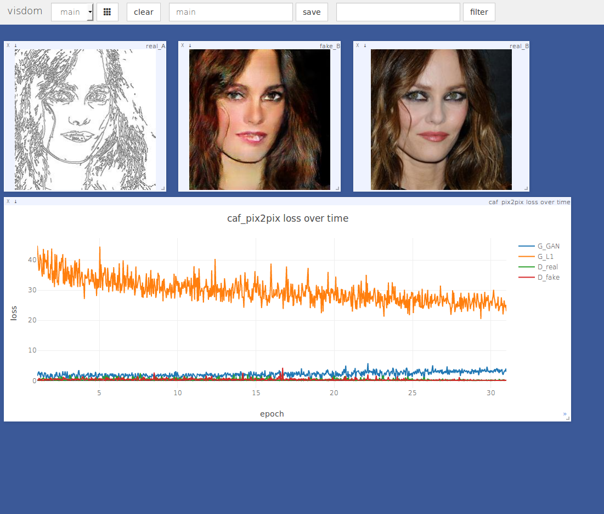
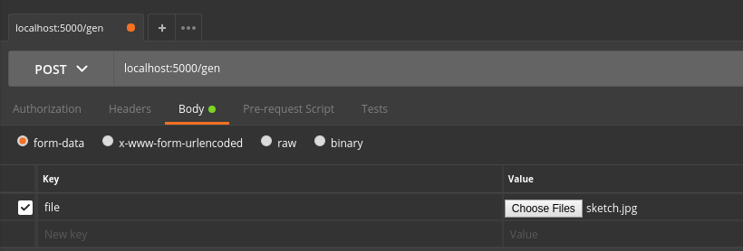
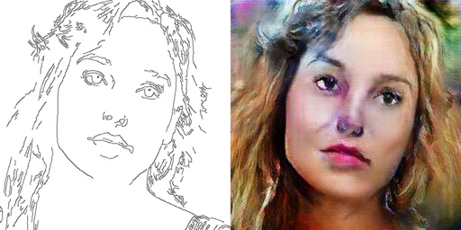

# Face generator using cGAN (Back End)

[Blog post](https://hiepph.gitlab.io/post/2017-10-16-cgan-face-generator/)

We proposed and had experiment with cGAN model ([Paper](https://arxiv.org/abs/1611.07004)) for face generating task from sketches.

Data is prepared from [CAF](http://blog.bayo.vn/caf/) dataset, including 8303 images of women's faces.

This repo is the Back End part of integrating [Pytorch](http://pytorch.org/) model with [Flask](http://flask.pocoo.org/) Python web framework. It serves RESTful-API request and return generated image.



Disclosure: The model implementation is written in Pytorch by [@junyanz](https://github.com/junyanz). Check out his project [pytorch-CycleGAN-and-pix2pix](https://github.com/junyanz/pytorch-CycleGAN-and-pix2pix). We use it for our research and implementation with retained [LICENSE](./LICENSE).


## Requirements

+ Follow installation at [pytorch-CycleGAN-and-pix2pix](https://github.com/junyanz/pytorch-CycleGAN-and-pix2pix)
+ [OpenCV](https://opencv.org/) 3
+ [Flask](http://flask.pocoo.org/): `pip install flask`
+ All training part is done in [pytorch-CycleGAN-and-pix2pix](https://github.com/junyanz/pytorch-CycleGAN-and-pix2pix)

```
git clone https://github.com/junyanz/pytorch-CycleGAN-and-pix2pix
cd pytorch-CycleGAN-and-pix2pix
```


## Data

Grab data from here: [CAF dataset, over 8.000 faces of famous actresses](http://blog.bayo.vn/caf/).

We use [crawler/face_edges.py](./crawler/face_edges.py) to get sketched images (`A`) from real CAF images (`B`).
And then separate train/validation ratio for each `A`, `B` as 80/20.

Script for combining them as trained input:

```
python datasets/combine_A_and_B.py --fold_A ./datasets/caf/A --fold_B ./datasets/caf/B --fold_AB ./datasets/caf
```

It now has `./datasets/caf/train` and `./datasets/caf/val`. You can have sense of each image like example below:




## Training

+ Script for training:

```
python train.py --dataroot ./datasets/caf --name caf_pix2pix --model pix2pix --which_model_netG unet_256 --which_direction AtoB --lambda_A 100 --dataset_mode aligned --no_lsgan --norm batch --pool_size 0 --batchSize 12 --save_latest_freq 1000 --niter 15 --niter_decay 15
```

+ Fire up `visdom` server for visualization at http://localhost:8097:

```
python -m visdom.server
```

We trained 30 epochs. It takes about 10 hours on an Nvidia GeForce GTX 960. And just 2.5 hours on 4 GPUs of AWS EC2 `p2.8xlarge` instances in comparison.
Train GAN is always expensive and time-consuming.

A glimpse of training process:




## Server integration

+ Back End part is now done in our repo:

```
git clone https://github.com/hiepph/cgan-face-generator
cd cgan-face-generator
```

+ Pre-trained model: You can grab [here](https://drive.google.com/file/d/0Bz1EQO3FGCUbYTViVTYxamhNb0E/view?usp=sharing), already included G model's weights `latest_net_G.pth`  and D model's weights `latest_net_D.pth`:

```
mv caf_cgan.zip cgan-face-generator
unzip cgan-face-generator
```

+ Fire up Flask server at port 5000:

```
python server.py --dataroot ./datasets/gal  --name caf_pix2pix --model test --which_model_netG unet_256 --which_direction AtoB --dataset_mode single --norm batch
```

+ Check connection:

```
curl 'localhost:5000/'
```

+ Now you can test uploading your sketch as `form-data` with `file` key, route is `POST /gen`:

```
curl -X POST -F "file=@/path/to/sketch.jpg" 'localhost:5000/gen' --output response.png
```

Or with [Postman](https://www.getpostman.com/):




## Demo




